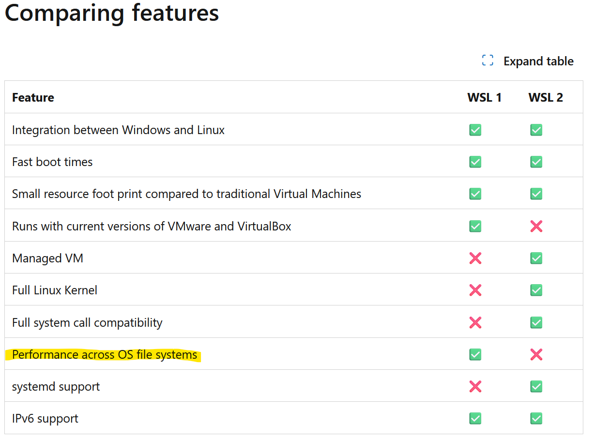

### Overview
If you are working on Windows, we recommend using [WSL](https://learn.microsoft.com/en-us/windows/wsl/about). WSL allows developers to run a Linux distro on a Windows machine without dealing with dual boot or a virtual machine. Additionally, both WSL and Windows can interact with each other's file systems\*. The reason we recommend WSL is that our support and testing on Linux is far more extensive than on Windows.

**Install WSL**: Follow this guide on [installing WSL](https://learn.microsoft.com/en-us/windows/wsl/install)

Once you have WSL installed, you may follow this guide and others as if you were on a Linux distro, with a couple of suggestions.

### WSL v.s Windows Filesystem

Earlier we stated that WSL and Windows have access to each other file systems. This is 100% true, with the caveat that it is [far, far slower](https://learn.microsoft.com/en-us/windows/wsl/filesystems) than interacting with either's native file system. Microsoft admits as much in their comparison between [WSL1 and WSL2](https://learn.microsoft.com/en-us/windows/wsl/compare-versions).

                                                                                                                                                    The takeaway here is to clone and keep all qwerty files in the WSL file system (i.e ~/). As a real world example, an undergraduate student cloned this repository using WSL onto their Window's filesystem. Running ``maturin develop -vvv`` was a multiday (>8 hrs) task. When moved to WSL, ``maturin develop -vvv`` took at most 10 minutes.

### WSL Ram Usage

By default, WSL is allocated **half** of the machine's RAM. If you'd like to increase this limit, [this guide](https://fizzylogic.nl/2023/01/05/how-to-configure-memory-limits-in-wsl2) is a nice and simple walkthrough.

### Additional Troubleshooting

For more general issues with WSL, here is the [official troubleshooting guide](https://github.com/MicrosoftDocs/wsl/blob/main/WSL/troubleshooting.md).
